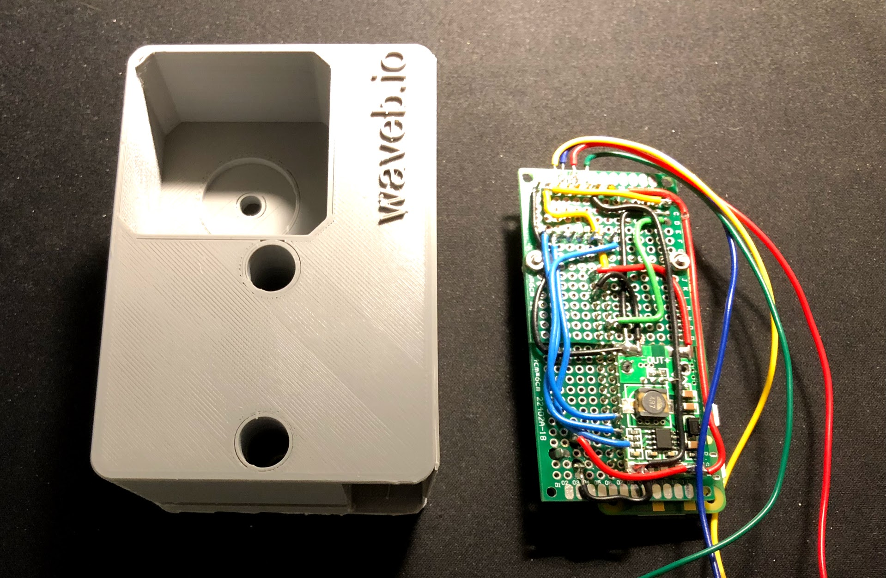
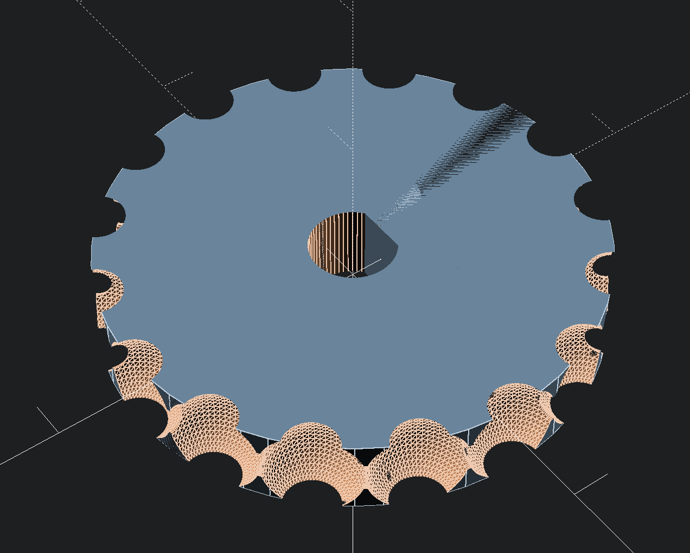
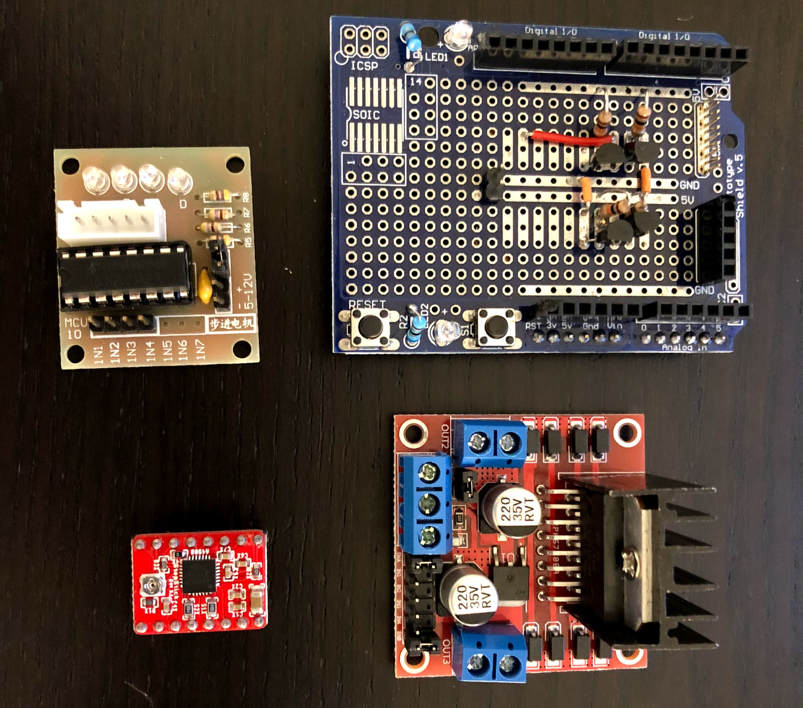

# autoblinds

### A simple project to control my blinds

The repository describes three the components I use to control the blinds in my room.

- 3D Printable gear and brackets
- Controller running on rPi Zero W
- Alexa SmartHome Skill

## 3D Objects

This was my first 3D printing project, and the first time I've used 3D CAD tools, so there are probably lots of bad practises here, feel free to use and improve these parts as you need.

In one of my earlier blind-brackets I used a [NEMA17](https://www.thingiverse.com/thing:1110041) part by [Zappyguy111](https://www.thingiverse.com/Zappyguy111/about). As it happens this part didn't have quite the right dimensions for my particular NEMA17, so I've included a modified version of this SCADs here.

### The gear

The gear I've provided here is a perfect match to the chain my blinds use. Not being an expert on the topic, I don't know how likely it is that you'll be able to reuse this part with any success.

### The bracket

There are two versions of the bracket included, the first, OpenSCAD based model is a minimal simple bracket for holding the NEAM17 and gear.

The second is a much larger construction that also contains a cavity for holding the electronics. This is the bracket I'm using, but I decided to venture out and learn a little about Autodesk Fusion 360 to create it.

Full bracket: https://a360.co/2Gnt3KY

## Raspberry Pi Zero W controller

I'm using a rPiZeroW to control the motor in the blinds just because I had one sitting on my desk at the time. I am well aware this could easily be done with an ESP32 or any number of lesser parts.

However since I did have a device that runs full Linux my controller takes advantage of the fact and uses some higher level libraries for convenience that make the code rather specific to the platform.

## Motor and Driver

After a bit of measurement I found that [these](https://www.amazon.com/gp/product/B0716S32G4/ref=oh_aui_detailpage_o09_s00?ie=UTF8&psc=1) 40Ncm NEMA17 motors would do a find job driving my blinds with the ⌀30mm gear. At $10 a motor there are cheaper options, but these work and thanks the Prime they are only 1 day away!

Now that we have motors we need to drive them. I did a little iteration on this point.

After some experimentation I learned what was perhaps the very clear and inevitable to anyone looking in from the outside. Dedicated stepper IC is smarter than Aijay - best just use one. So I picked up some [Elegoo Stepsticks](https://www.amazon.com/Elegoo-Stepstick-Stepper-Printer-Robotics/dp/B01GJJGRF2/ref=pd_bxgy_328_img_2?_encoding=UTF8&pd_rd_i=B01GJJGRF2&pd_rd_r=SDF0A2E9CBVYZ0JKECQZ&pd_rd_w=6Vk86&pd_rd_wg=LCmu1&psc=1&refRID=SDF0A2E9CBVYZ0JKECQZ) at about $2 each. This little module has an A4988 which I am operating in 1/8th step mode to drive my blinds.

## Alexa SmartHome Skill

This part is only interesting if you have grown so dependent on your Amazon Alexa that you can't imagine having to reach for a device to control your smart devices anymore. I put this in it's own [README](https://github.com/aijayadams/autoblinds/tree/master/alexa-smarthome) if you're interested.
