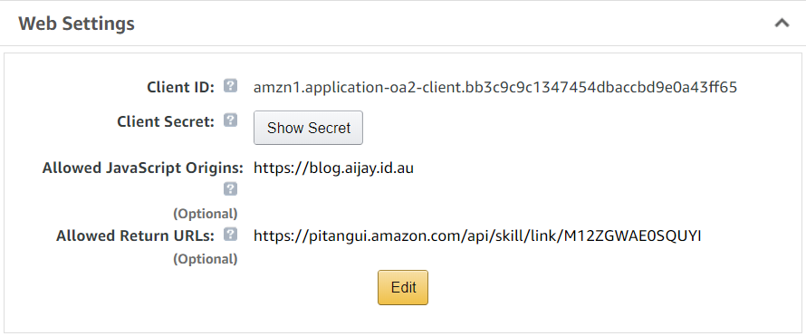
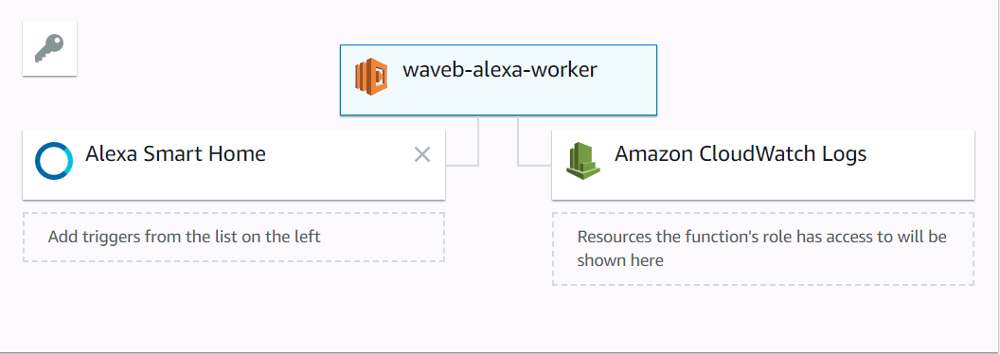
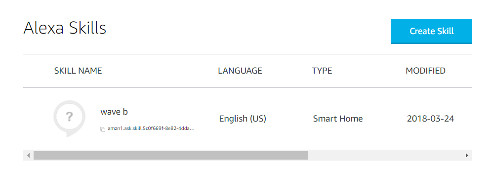
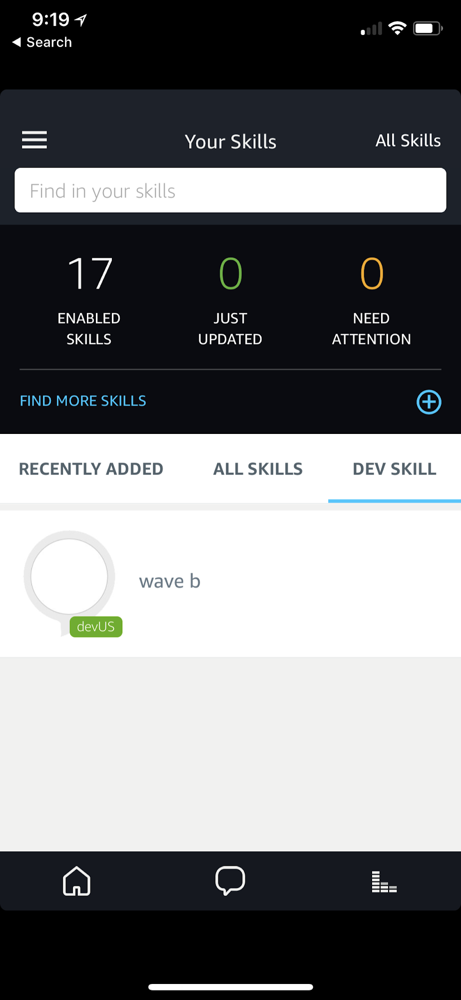

# Waveb autoblinds Alexa Skill

**WARNING: This is probably not the right way**

A couple of quick searches on the internet lead me quickely to the idea that I wanted to use a SmartHome skill so that it could be controlled with the simple command

> "Alexa, open the blinds 50 percent"

Rather then a more general skill

> "Alexa, tell waveB to open the blinds 50 percent"

This turned out to be pretty easy (at least when you are willing to take all the shortcuts!).

I broadly followed this [guide](https://developer.amazon.com/docs/smarthome/steps-to-build-a-smart-home-skill.html), but to get things working required following it out to many other pages in the broad amazon ecosystem, so here is a concise version of what is needed.

There is no clear order to create the components below as you need to provide ID's and secrets between them all during configuration and setup. I recommend opening 3 tabs to make going back and forward between the services easy as you are configuring them.

## Create a Login with Amazon App
You must provide account linking functionality to a SmartHome with an OAuth2.0 provider. Given this is really a standalone exercise in my world I created a dedicated [Login with Amazon](http://login.amazon.com/) app handle account linking.

This is a relatively straightforward process, just make sure you allow the return URL of your skill (I had to setup account linking and go through the  LWA error page to get this URL).

## Create AWS Lambda

Creating a Lambda to respond to your skill is pretty simple, but there is one point I overlooked and wasted an hour trying to debug. At this wiring, if you want to supply a single Lambda to process your skill and you are in North America the **Lambda must be defined in the US-East-1 (N.Virginia) region**.

The Lambda requires a little bit of special setup, but it's all very obvious when you think about it. There needs to be a trigger from Alexa SmartHome, where your Skill ID.

The Lambda needs to be able to execute, so make sure it has an execution role associated that allows it!

Logging is optional, but we all know logs are great, so to avoid pain and make debugging possible ensure your Lambda has an execution role that allows it to log to CloudWatch.

The lambda I used is little more then a payload 3.0 hello world. It implements Alexa.Discovers::Discovery and Alexa.PercentageController::SetPercentage. The only thing here this is more then example code is that I take the received percentage and inform my blinds with a simple http request. I take advantage of amazon VPC to give my Lambda access to the private network on which the blind controller lives, but you could easily write to MQTT or call ITTT etc. At this stage we are just writing simple node.js, and if you don't put your Lambda in a VPC it will have full internet access.

## Create the Alexa Skill

Creating the alexa smart home skill in the [Alexa Console](https://developer.amazon.com/alexa/console/ask) is really just a matter of clicking next and entering information about the Lambda and OA2.0 account linking as required. SmartHome defines all the interfaces you will need out of the box and there really isn't a lot to configure here.

## Active the skill in your Alexa app
Activate the skill on your app and link your account. This is the part where I had to experience a LWA error and go back to amend my Allowed Return URLs. Once this happened everything went swimmingly and I had my new 'blinds' device.

